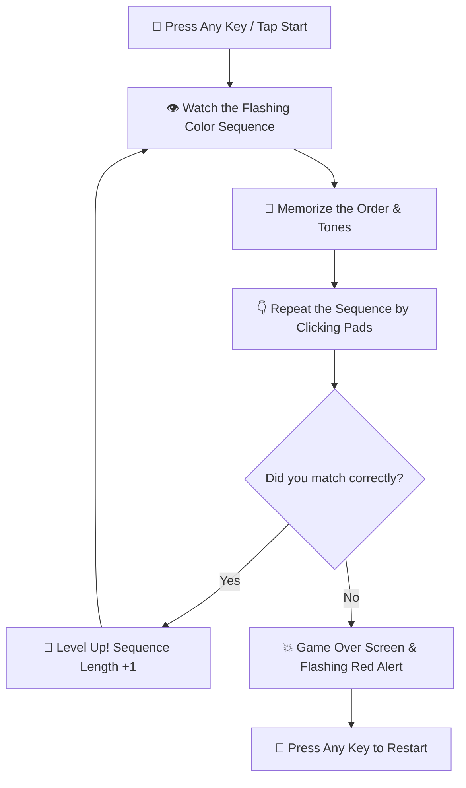

# 🎮 SIMON SAYS — Ultimate Memory Master

<div align="center">

  

  <p align="center">
    <b>A retro-modern arcade memory game crafted with sleek glowing UI, smooth animations, and crisp audio cues!</b>
  </p>

  <!-- Badges -->
  <p align="center">
    <a href="https://github.com/your-username/Simon-Says-Game/stargazers">
      
    </a>
    <a href="https://github.com/your-username/Simon-Says-Game/network/members">
      
    </a>
    <a href="https://github.com/your-username/Simon-Says-Game/issues">
      
    </a>
    <a href="https://github.com/your-username/Simon-Says-Game/blob/main/LICENSE">
      
    </a>
  </p>

  <p align="center">
    <a href="#-demo--preview"><b>View Demo</b></a> •
    <a href="#-key-features"><b>Features</b></a> •
    <a href="#-how-to-play"><b>How To Play</b></a> •
    <a href="#-getting-started"><b>Installation</b></a> •
    <a href="#-tech-stack"><b>Tech Stack</b></a>
  </p>

  <br/>

  <!-- Banner / Visual Showcase -->
  

</div>

<hr />

## 🌟 Demo & Preview

<div align="center">

```
   ┌────────────────────────────────────────────────────────┐
   │                                                        │
   │      🔴 RED                  🟢 GREEN                  │
   │   ┌──────────┐            ┌──────────┐                 │
   │   │  FLASH!  │            │  READY   │                 │
   │   └──────────┘            └──────────┘                 │
   │                                                        │
   │      🟡 YELLOW               🔵 BLUE                   │
   │   ┌──────────┐            ┌──────────┐                 │
   │   │  WAIT... │            │  PRESS   │                 │
   │   └──────────┘            └──────────┘                 │
   │                                                        │
   │              CURRENT SCORE: 08 | HIGH SCORE: 15        │
   └────────────────────────────────────────────────────────┘
```

> ⚡ **Live Gameplay Experience:** Dynamic lighting, custom sound frequency synthesis, and neon glassmorphism layout!

</div>

<br/>

## ✨ Key Features

<table>
  <tr>
    <td width="50%">
      <h3 align="center">🎨 Neon Glassmorphism UI</h3>
      <p>Sleek modern cyber aesthetics with glowing borders, radial gradients, floating backdrop particles, and responsive hover effects.</p>
    </td>
    <td width="50%">
      <h3 align="center">🔊 Dynamic Audio Feedback</h3>
      <p>Unique Web Audio API frequencies / sound cues for each color pad, providing instant tactile audio-visual synchronization.</p>
    </td>
  </tr>
  <tr>
    <td width="50%">
      <h3 align="center">⚡ Escalating Difficulty</h3>
      <p>Pattern sequences grow exponentially longer and faster as you level up, testing short-term memory and lightning-fast reflexes.</p>
    </td>
    <td width="50%">
      <h3 align="center">💾 Local High Score Tracking</h3>
      <p>Automatically saves your highest level achieved in browser storage so you can continuously challenge yourself and friends.</p>
    </td>
  </tr>
</table>

<br/>

## 🎯 How To Play



1. **Start the Game:** Press any key on your keyboard or tap the screen to initiate Level 1.
2. **Observe:** Simon will light up a button and play a distinct sound.
3. **Repeat:** Click/tap the exact same button to pass.
4. **Master:** Each round adds one new color pad to the growing sequence!

<br/>

## 🛠️ Tech Stack

<div align="center">

| Technology | Purpose | Badges |
| :--- | :--- | :--- |
| **HTML5** | Game Structure & Canvas |  |
| **CSS3** | Animations, Glows & Glassmorphism |  |
| **JavaScript** | Game Logic & Sequence State Machine |  |
| **Web Audio API** | Synthesized Sound Cues |  |

</div>

<br/>

## 🚀 Getting Started

Follow these steps to get a local copy up and running on your machine:

### 1️⃣ Clone the Repository
```bash
git clone https://github.com/your-username/Simon-Says-Game.git
```

### 2️⃣ Navigate to Project Directory
```bash
cd Simon-Says-Game
```

### 3️⃣ Launch the Game
Open `index.html` directly in your web browser, or launch using Live Server in VS Code:
```bash
# Using VS Code Live Server extension or simple python HTTP server
python -m http.server 8000
```
Then visit `http://localhost:8000` in your browser.

<br/>

## 📁 Project Structure

```
Simon-Says-Game/
│
├── 📂 assets/
│   ├── 📂 sounds/         # Audio files for color pads (red, green, yellow, blue, wrong)
│   └── 📂 images/         # Game screenshots, favicons, and banners
│
├── 📜 index.html          # Game structure & main DOM elements
├── 🎨 style.css           # Custom styles, keyframe animations & glass effect
├── ⚡ app.js              # State handler, sequence generator & event listeners
└── 📖 README.md           # Project documentation
```

<br/>

## 🤝 Contributing

Contributions make the open-source community an amazing place to learn, inspire, and create! Any contributions you make are **greatly appreciated**.

1. Fork the Project
2. Create your Feature Branch (`git checkout -b feature/AmazingFeature`)
3. Commit your Changes (`git commit -m 'Add some AmazingFeature'`)
4. Push to the Branch (`git push origin feature/AmazingFeature`)
5. Open a Pull Request

<br/>

## 📜 License

Distributed under the MIT License. See [`LICENSE`](./LICENSE) for more information.

<br/>

<div align="center">

  <sub>Crafted with ❤️ and ⚡ by <a href="https://github.com/your-username">Your Name</a></sub>

  <br/><br/>

  <a href="#-simon-says--ultimate-memory-master">
    
  </a>

</div>
